# Stroke prediction

The significant percentage of strokes are preventable. In this project, my goal is to delve into the world of **stroke prediction**. The dataset I'm working with spans diverse age groups, genders, and includes information about habits and various health-related factors. Ultimately, the objective is to build a predictive model. Through transformations and selecting the best model, I aspire to develop an effective tool that can estimate the probability of stroke based on the provided data. 

# Data cleaning and visualizations
1) id: unique identifier
2) gender: "Male", "Female" or "Other"
3) age: age of the patient
4) hypertension: 0 if the patient doesn't have hypertension, 1 if the patient has hypertension
5) heart_disease: 0 if the patient doesn't have any heart diseases, 1 if the patient has a heart disease
6) ever_married: "No" or "Yes"
7) work_type: "children", "Govt_jov", "Never_worked", "Private" or "Self-employed"
8) Residence_type: "Rural" or "Urban"
9) avg_glucose_level: average glucose level in blood
10) bmi: body mass index
11) smoking_status: "formerly smoked", "never smoked", "smokes" or "Unknown"*
12) stroke: 1 if the patient had a stroke or 0 if not

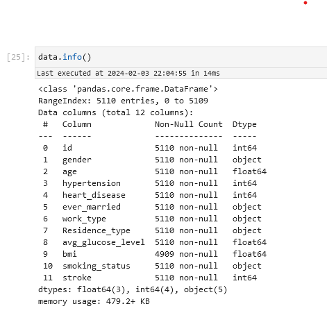

Firstly, i tried to clean the data. I made some steps, like ***dropping 'id' columns*** which was not useable,  ***removing rows where 'bmi'*** was null since i knew that i can afford that due to having enough data. I've ***converted 'work_type' and 'smoking_status' to binary*** indictaros. I also realised that there were almost no data where gender = other, so i have removed those rows and changed it to binary values.

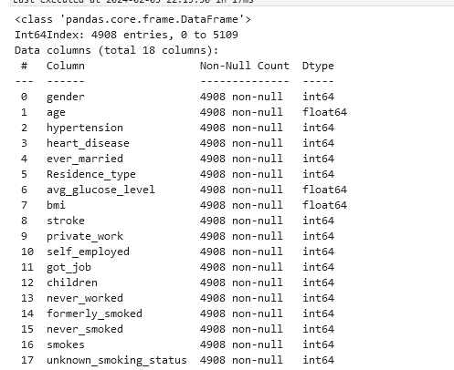

Then i created **matrix correlation** with numeric variables and i turned out that the correlation between all variables is small so i could take it as it was.

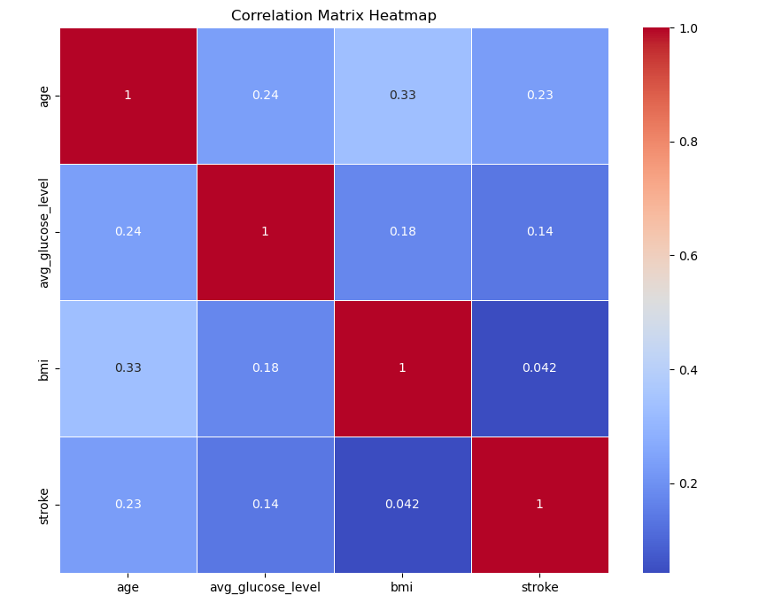

**Histogram & density plot** describes the age, average glucose level and bmi. The median group are adult people. Glucose level distribution is skewed towards left and the biggets group has around 80 mg/dl. 
BMI is highly skewed and the median is around 27.

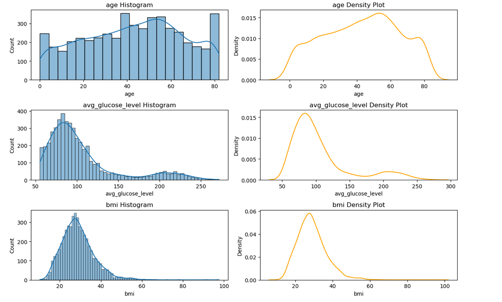

The plot displays ***average glucose level and age*** We can see the trend, the more aged people and higher glucose level, then more stroke events.

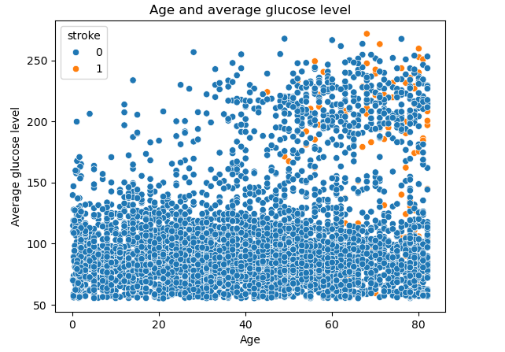

This plot  displays ***average glucose level and bmi***. It is similiar to previous one, stroke occurs more to people with high bmi and high glucose level.

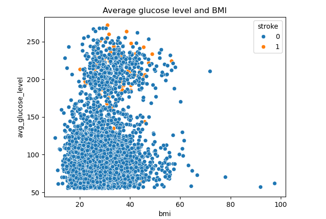

# Building models
Our data was imbalanced, that could have big impact on the model performance. So i decided to use **undersampling method - SMOTE.**

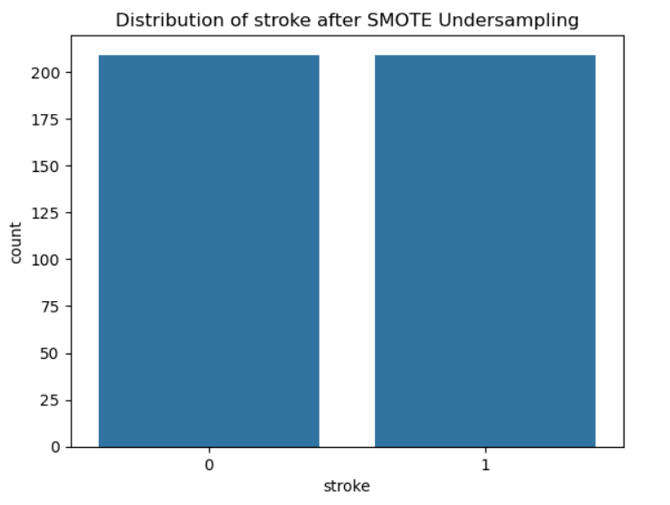

Then i moved to split data to train and test sets. I have **normalized data, using MinMaxScaler**. Having features on similar scales can prevent one feature from dominating the learning process simply because it has a larger magnitude. The first algorithm I used was belonging to **Supervised Machine Learning - Support Vector Machine**. SVM is algorithm used for classification and regression tasks. It works by finding the hyperplane that best separates the data into different classes, maximizing the margin between classes and relying on support vectors for decision boundary determination.

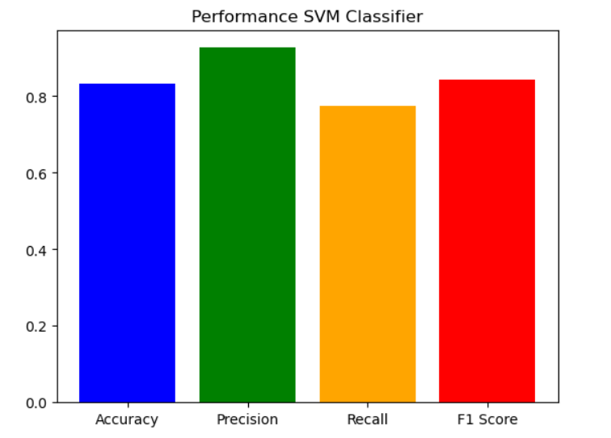
The scores of the SVM algorithm:

- ***Accuracy (0.83)***: This represents the overall correctness of the model in predicting both stroke and non-stroke cases. An accuracy of 83% suggests that the model correctly predicted 83% of the cases.

- ***Precision (0.93)***: This indicates the proportion of predicted stroke cases that are true positives. In the context of a stroke predictor, high precision means that when the model predicts a person is at risk of a stroke, it is correct about 93% of the time.

- ***Recall (0.78)***: This measures the model's ability to correctly identify individuals who are actually at risk of a stroke. A recall of 78% suggests that the model captures about 78% of the true stroke cases.

- ***F1 Score (0.84)***:  It provides a balanced measure, especially useful when false positives and false negatives are both critical. An F1 Score of 84% indicates a good balance between precision and recall.

In the context of a stroke predictor, achieving high precision is essential to minimize false alarms, while a high recall ensures that the model identifies a significant portion of actual stroke cases. It's crucial to consider the specific requirements of the task and the potential impact of false positives and false negatives in a medical context.

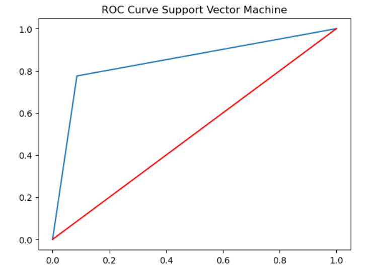

The **ROC curve** visualizes the relationship between the effectiveness of positive classification (sensitivity) and the ineffectiveness of negative case classification (1 - specificity) at each probability level.
It shows the percentage of misclassifications (positive and negative) for a given threshold.         
  
  
Then, i used **KNN algorithms** with k=3 and k=5. K-nearest neighbors, is a classification algorithm that assigns a data point to a specific category based on the majority class of its k-nearest neighbors in the feature space. It utilizes the principle that similar data points tend to belong to the same class, making it a non-parametric and instance-based learning method in machine learning.

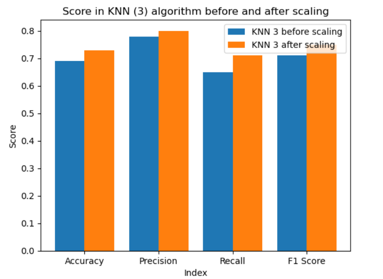

This ***model knn=5 is more balanced***, more resistant to noise or deviations in the data than knn=3 because it can be used for more advanced forecasts.

The initial node at the top of the **decision tree** is referred to as the root node. It makes decisions on how to partition based on attribute values, following a recursive partitioning process. This flowchart-style arrangement aids in decision-making and resembles human-level thinking. Decision trees are visually similar to flowchart diagrams, contributing to their ease of understanding and interpretation. This inherent simplicity makes decision trees accessible for analysis and comprehension.
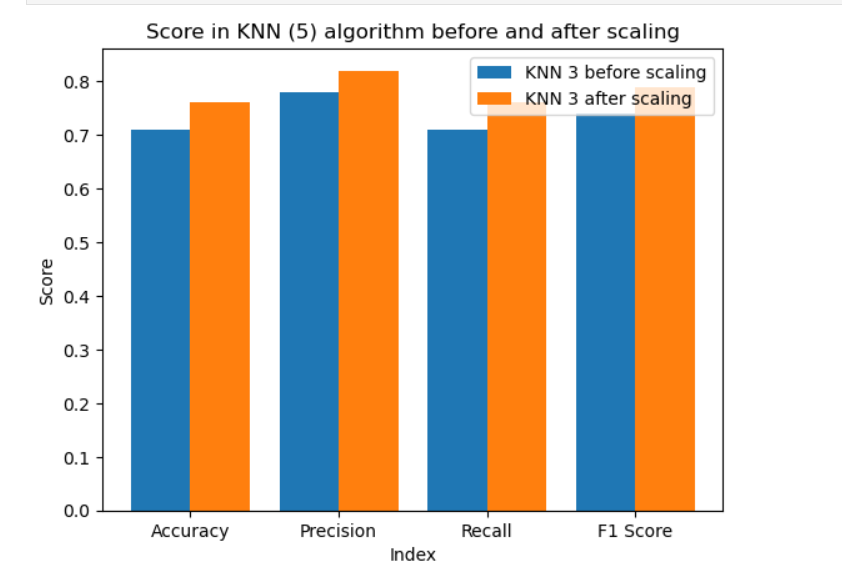

A ***decision tree*** is a tree-like structure resembling a flowchart. In this structure, internal nodes represent features or attributes, branches depict decision rules, and each leaf node signifies an outcome.
The initial node at the top of the decision tree is referred to as the root node. It makes decisions on how to partition based on attribute values, following a recursive partitioning process. This flowchart-style arrangement aids in decision-making and resembles human-level thinking. Decision trees are visually similar to flowchart diagrams, contributing to their ease of understanding and interpretation. This inherent simplicity makes decision trees accessible for analysis and comprehension.

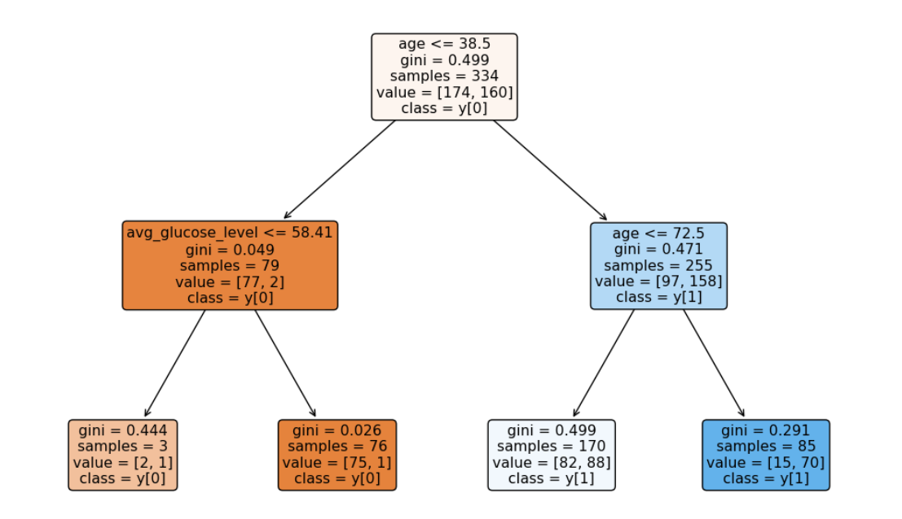

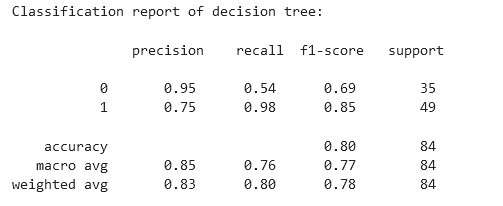

The ***decision tree model*** for stroke prediction shows a high **precision for predicting strokes at 76%**, suggesting that when it predicts a stroke, it is correct 76% of the time. The **recall for strokes is also relatively high at 90%**, indicating that the model successfully captures 90% of actual stroke cases. The overall performance is summarized with an **accuracy of 77%**, providing a balanced view of the model's effectiveness in predicting strokes.   

# Conclusion

For all four algorithms, the algorithm K-nearest neighbours with k=5 and Support Vector Machine looks the best and have similiar scores. The worst on is decision tree model.
