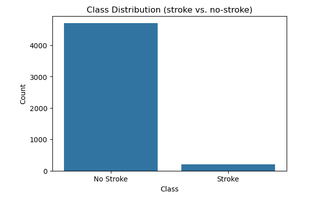

# Stroke-prediction

Do you know, 80% Heart strokes are preventable?, yes they are. In this notebook, we attempted to visulize some key indicators that lead to heart strokes. Here data is sampled from a wide range of age groups, gender, habits and health related issues. Most of the visualizations are self expilantory and try to stick to simple visualization but effiective method to convey most of the information.
Problem Statement

Visululize the relationships between various Healthy and Unhealthy habits to Heart Strokes, and there by predict the stroke probability with best model and hypertuned parameters.

# Data cleaning
 

Firstly, i tried to clean the data. I made some steps, like dropping 'id' columns which was not useable,  removing rows where 'bmi' was null since i knew that i can afford that due to having enough data. I've converted 'work_type' and 'smoking_status' to binary indictaros. I also realised that there were almost no data where gender = other, so i have removed those rows and changed it to binary values.

Then i created matrix correlation with numeric variables and i turned out that the correlation between all variables is small so i could take it as it was.

Histogram & density plots describes the age, average glucose level and bmi. The median group are adult people. Glucose level distribution is skewed towards left and the biggets group has around 80 mg/dl. 
BMI is highly skewed and the median is around 27.

The plot displays average glucose level and age. We can see the trend, the more aged people and higher glucose level, then more stroke events.

This plot  displays average glucose level and bmi. It is similiar to previous one, stroke occurs more to people with high bmi and high glucose level.

Our data was imbalanced, that could have big impact on the model performance. So i decided to use undersampling method - SMOTE. 

Then i moved to split data to train and test sets. I have normalized data, using MinMaxScaler. Having features on similar scales can prevent one feature from dominating the learning process simply because it has a larger magnitude. The first algorithm I used was belonging to Supervised Machine Learning - Support Vector Machine. SVM is algorithm used for classification and regression tasks. It works by finding the hyperplane that best separates the data into different classes, maximizing the margin between classes and relying on support vectors for decision boundary determination.

The scores of the SVM algorithm:

- Accuracy (0.83): This represents the overall correctness of the model in predicting both stroke and non-stroke cases. An accuracy of 83% suggests that the model correctly predicted 83% of the cases.

- Precision (0.93): This indicates the proportion of predicted stroke cases that are true positives. In the context of a stroke predictor, high precision means that when the model predicts a person is at risk of a stroke, it is correct about 93% of the time.

- Recall (0.78): This measures the model's ability to correctly identify individuals who are actually at risk of a stroke. A recall of 78% suggests that the model captures about 78% of the true stroke cases.

- F1 Score (0.84):  It provides a balanced measure, especially useful when false positives and false negatives are both critical. An F1 Score of 84% indicates a good balance between precision and recall.

In the context of a stroke predictor, achieving high precision is essential to minimize false alarms, while a high recall ensures that the model identifies a significant portion of actual stroke cases. It's crucial to consider the specific requirements of the task and the potential impact of false positives and false negatives in a medical context.

